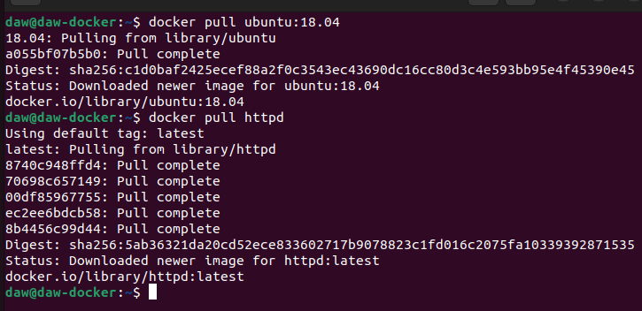
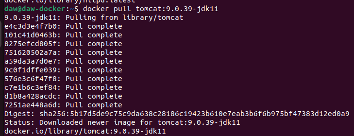
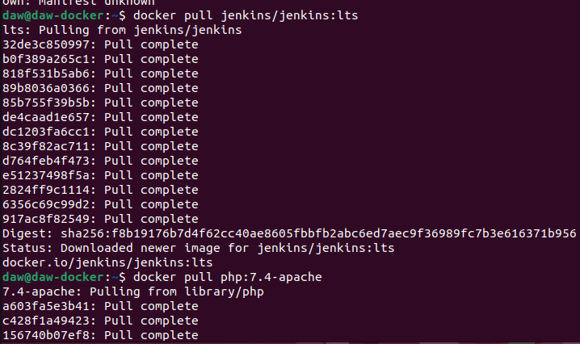
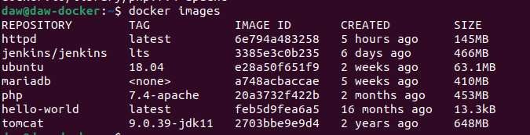
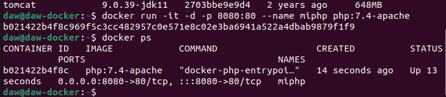
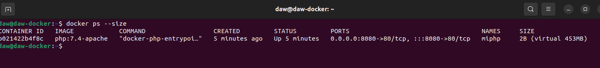
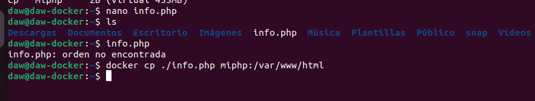
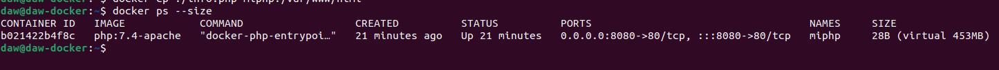
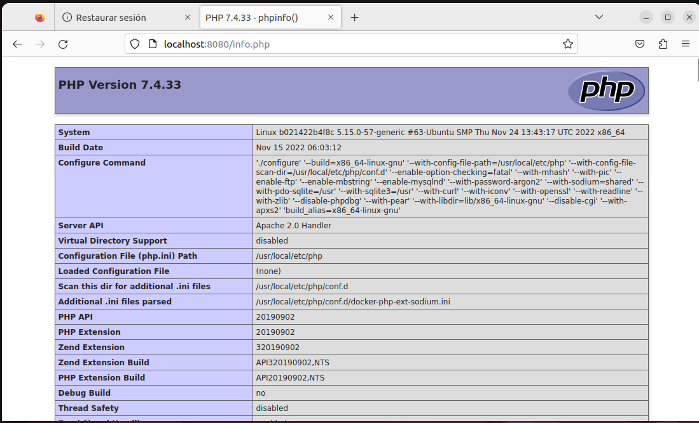

# Ejercicios Docker 2 - Imagenes

1. Descarga las siguientes imágenes: ubuntu:18.04, httpd, tomcat:9.0.39-jdk11,jenkins/jenkins:lts, php:7.4-apache.

2. Muestras las imágenes que tienes descargadas.

3. Crea un contenedor demonio con la imagen php:7.4-apache.

4. Comprueba el tamaño del contenedor en el disco duro.

Lo he intentado tambien con inspect -s pero no me funciona

5. Con la instrucción docker cp podemos copiar ficheros a o desde un contenedor. Puedes encontrar información es esta <a href="https://docs.docker.com/engine/reference/commandline/cp/" target="_blank">página</a>. Crea un fichero en tu ordenador, con el siguientecontenido:Copia un fichero info.php al directorio /var/www/html del contenedor con docker cp.

6. Vuelve a comprobar el espacio ocupado por el contenedor.

7. Accede al fichero info.php desde un navegador web.

