# Ejercicios Docker Redes

## Trabajar con redes docker
### 1. Vamos a crear dos redes de ese tipo (BRIDGE) con los siguientes datos:

Red1
* Nombre: red1
* Dirección de red: 172.28.0.0
* Máscara de red: 255.255.0.0
* Gateway: 172.28.0.1

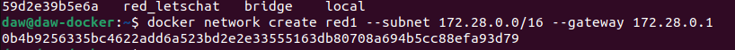

Red2
* Nombre: red2
* Es resto de los datos será proporcionados automáticamente por Docker.

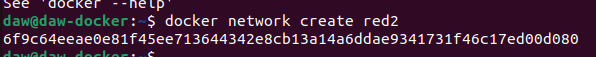
### 2. Poner en ejecución un contenedor de la imagen ubuntu:20.04 que tenga como hostname host1 , como IP 172.28.0.10 y que esté conectado a la red1. Lo llamaremos u1.

Creamos el contenedor con las especificaciones requeridas

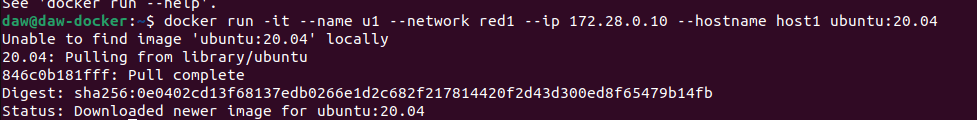


### 3. Entrar en ese contenedor e instalar la aplicación ping (apt update && apt install inetutils-ping).

Pues nada, dentro del contenedor ejecutamos esos comandos

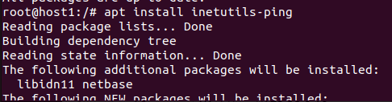

### 4. Poner en ejecución un contenedor de la imagen ubuntu:20.04 que tenga como hostname host2 y que esté conectado a la red2. En este caso será docker el que le de una IP correspondiente a esa red. Lo llamaremos u2.

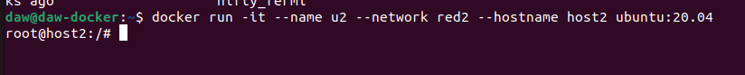

### 5. Entrar en ese contenedor e instalar la aplicación ping (apt update && apt install inetutils-ping)

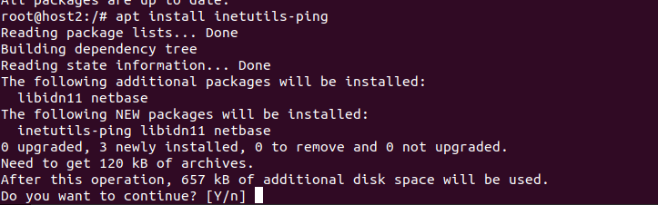

### El documento debe contener, además, los siguientes pantallazos:
* Pantallazo donde se vea la configuración de red del contenedor u1.

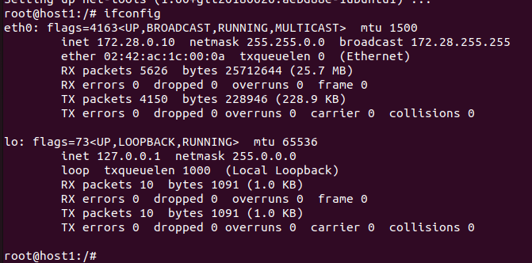

* Pantallazo donde se vea la configuración de red del contenedor u2.

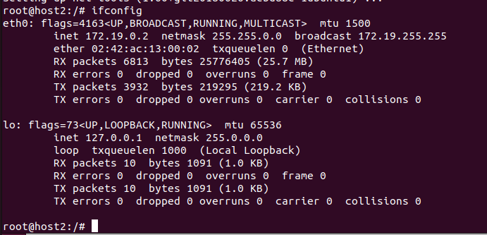

* Pantallazo donde desde cualquiera de los dos contenedores se pueda ver que no podemos hacer ping al otro ni por ip ni por nombre.

Comprobamos que no se comunica el host1 con la ip del host2

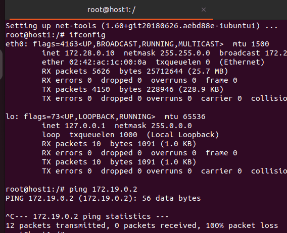

* Pantallazo donde se pueda comprobar que si conectamos el contenedor u1 a la red2 (con docker network connect ), desde el contenedor u1, tenemos acceso al contenedor u2 mediante ping, tanto por nombre como por ip.

Conectamos la red2 al contenedor u1

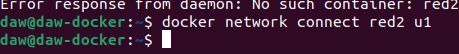

Y ahora si tendrian conexión

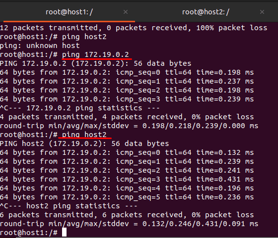

## Despliegue de Nextcloud + mariadb/postgreSQL

### 1. Crea una red de tipo bridge.

Creamos una red de tipo bridge por defecto y utilizamos inspect para ver sus propiedades

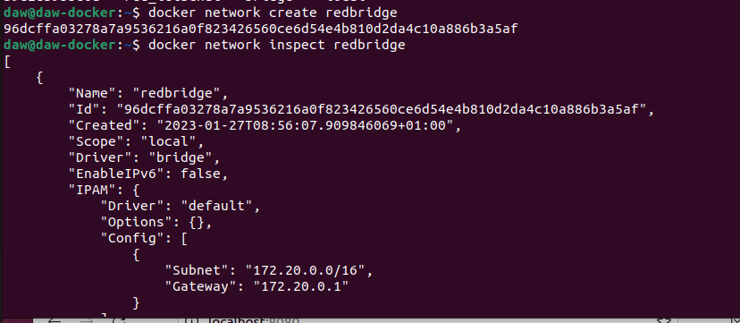

### 2. Crea el contenedor de la base de datos conectado a la red que has creado. La base de datos se debe configurar para crear una base de dato y un usuario. Además el contenedor debe utilizar almacenamiento (volúmenes o bind mount) para guardar la información. Puedes seguir la documentación de mariadb o la de PostgreSQL .

Creamos un volumen y configuramos las variables especificadas

```
docker run -d --name mymaria --env MARIADB_USER=usuario --env MARIADB_PASSWORD=contraseña --env MARIADB_ROOT_PASSWORD=laboral1 -v volumensql:/var/run/mysqld --network redbridge -p 8080:80 mariadb:10.5
```

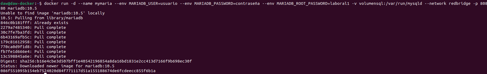

### 3. A continuación, siguiendo la documentación de la imagen nextcloud , crea un contenedor conectado a la misma red, e indica las variables adecuadas para que se configure de forma adecuada y realice la conexión a la base de datos. El contenedor también debe ser persistente usando almacenamiento.

Hacemos lo mismo que en el contenedor de maria para el nextcloud, creando previamente un volumen para el

```
docker run -d -v volumennextcloud:/var/www/html --network redbridge --env MYSQL_DATABASE=mymaria -p 8081:80 nextcloud
```

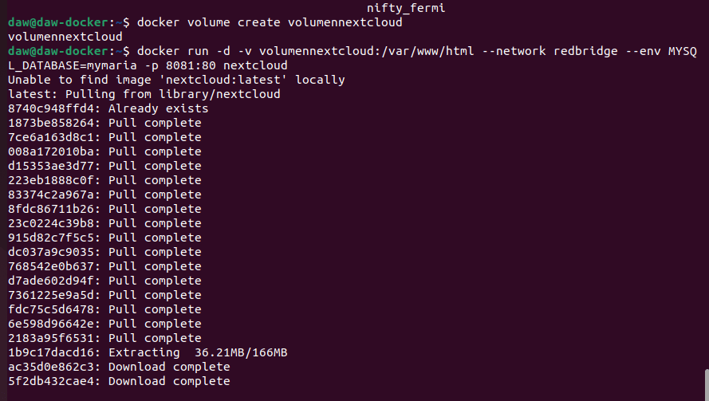

### 4. Accede a la aplicación usando un navegador web.

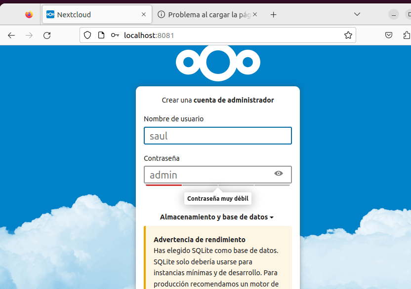

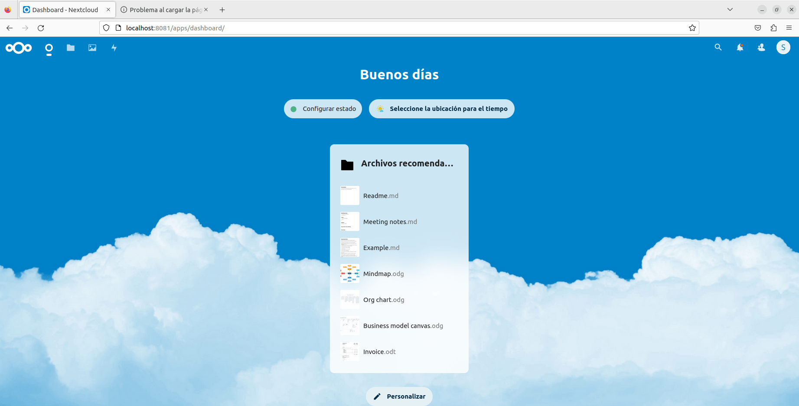