# Docker Ejercicios Repaso

### 1. Instala docker en una máquina y configúralo para que se pueda usar con un usuario sinprivilegios.

Estoy utilizando la MV de clase, pero los comandos para conseguirlo serian:

instalamos docker
```
apt install docker.io
```
Para utilizar docker 
```
usermod -aG docker usuario
```


### 2. Ejecuta un contenedor a partir de la imagen hello-word. Comprueba que nos devuelve la salida adecuada. Comprueba que no se está ejecutando. Lista los contenedores que están parado. Borra el contenedor.

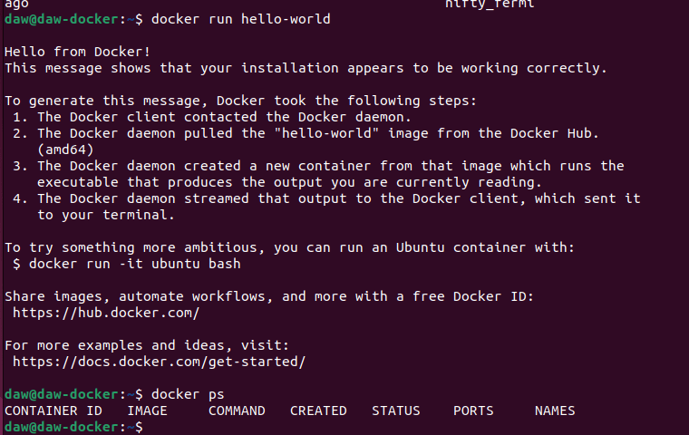
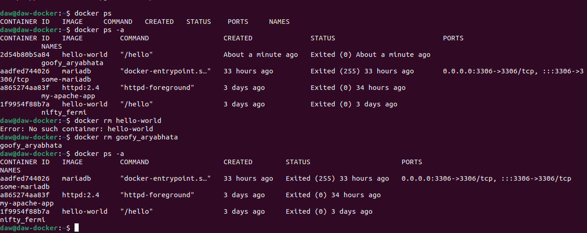

### 3. Crea un contenedor interactivo desde una imagen debian. Instala un paquete (por ejemplonano). Sal de la terminal, ¿sigue el contenedor corriendo? ¿Por qué?. Vuelve a iniciar elcontenedor y accede de nuevo a él de forma interactiva. ¿Sigue instalado el nano?. Sal delcontenedor, y bórralo. Crea un nuevo contenedor interactivo desde la misma imagen. ¿Tieneel nano instalado?

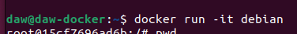
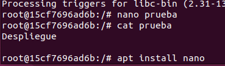

Si abrimos otra terminal vemos que seguira activo

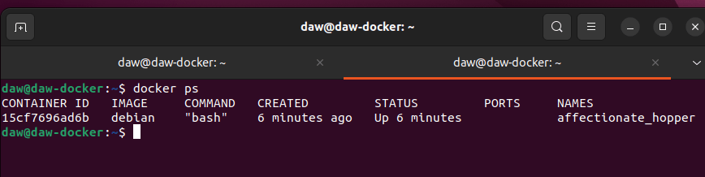

Si nos salimos del contenedor:

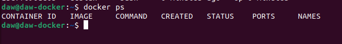

Lo volvemos a ejecutar y vemos que seguimos teniendo nano
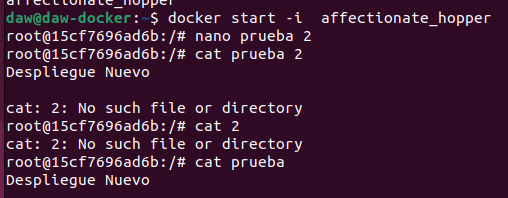

Borramos y creamos otro contenedor con la misma imagen y obviamente veremos que no tenemos el nano
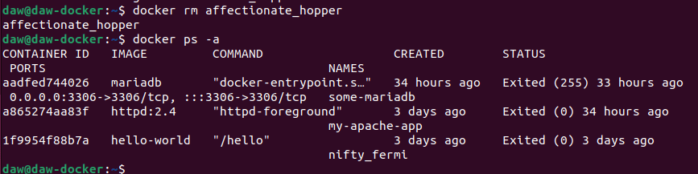
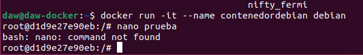

### 4. Crea un contenedor demonio con un servidor nginx, usando la imagen oficial de nginx. Alcrear el contenedor, ¿has tenido que indicar algún comando para que lo ejecute? Accede alnavegador web y comprueba que el servidor esta funcionando. Muestra los logs delcontenedor.

Creamos el contenedor con la imagen oficial de nginx, no hemos tenido que indicar ningun comando para que se ejecute ya que le hemos metido modificadores para que lo haga directamente
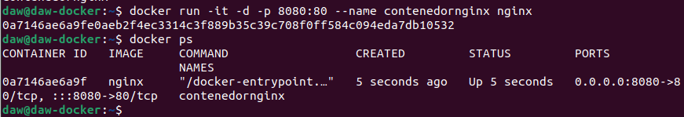
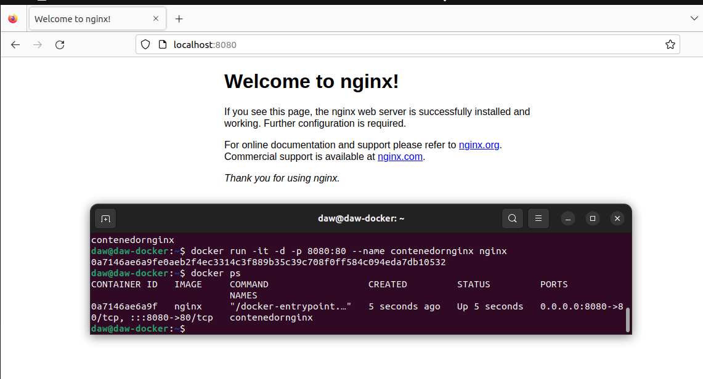
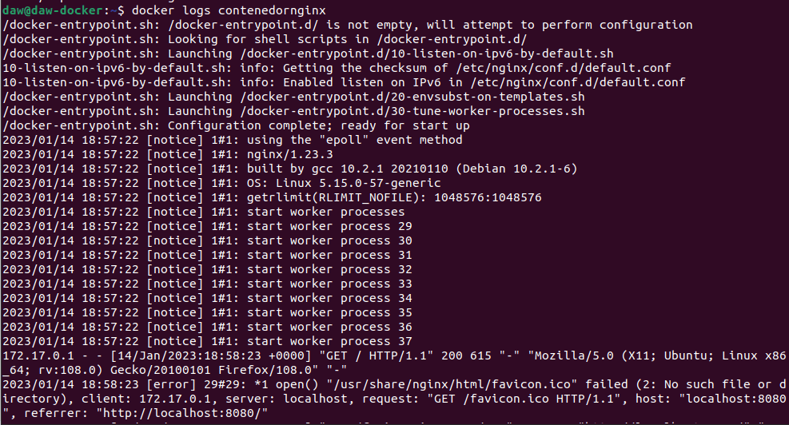

### 5. Crea un contenedor con la aplicación Nextcloud, mirando la documentación en docker Hub,para personalizar el nombre de la base de datos sqlite que va a utilizar.

Utilizaremos esta <a href="https://hub.docker.com/_/nextcloud" target="_blank">pagina de referencia</a>

Creamos el contenedor, utilizando el puerto 8080 con la imagen de nextcloud
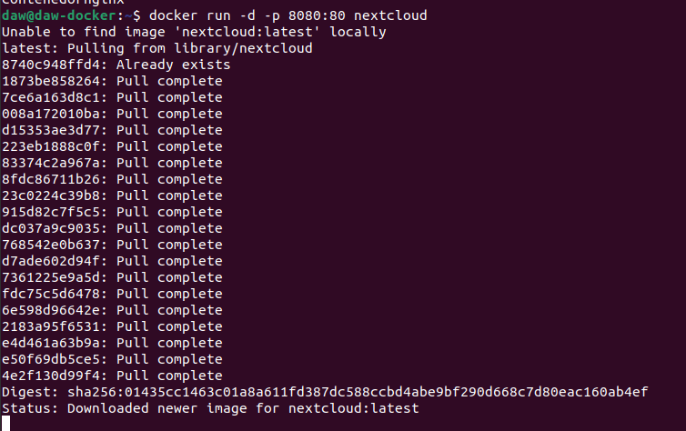

Cuando acaba podemos ir a localhost para crear una cuenta de administrador y realizar unas ultimas configuraciones
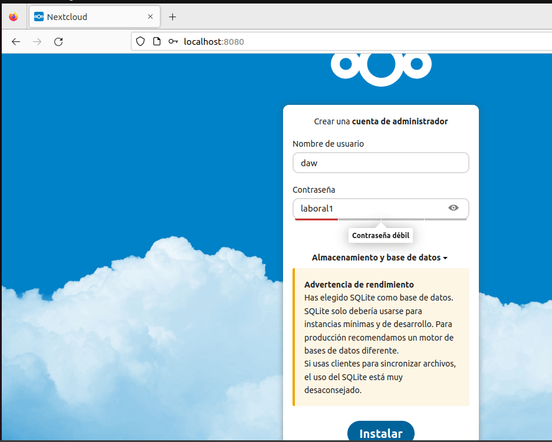
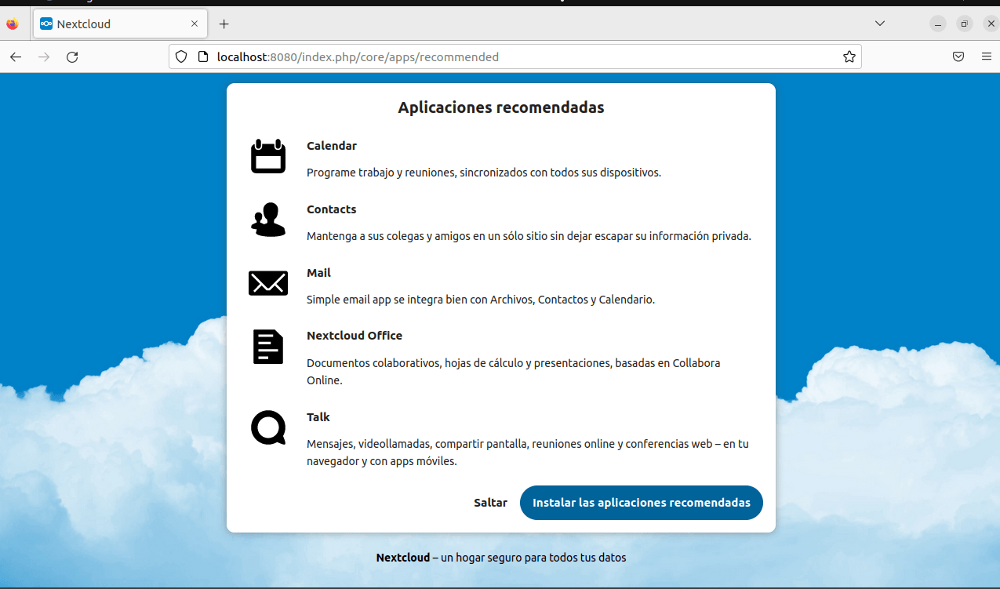

Y ya lo tendriamos todo disponible:

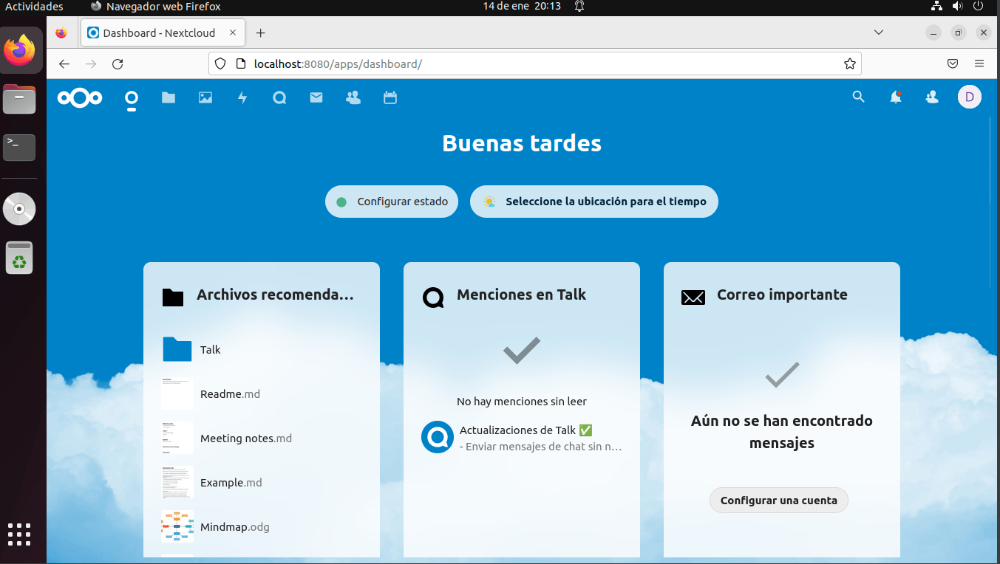